# Deber_componentes
## Integrantes: Brandon Sandoval, Andrew Vilcacundo y Cristian Paredes

# EJERCICIO 1:

## Datos
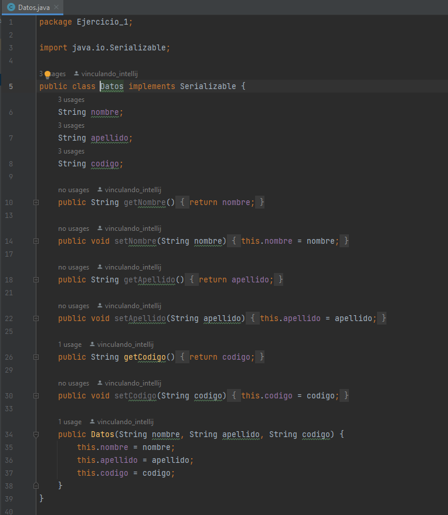
## Registro
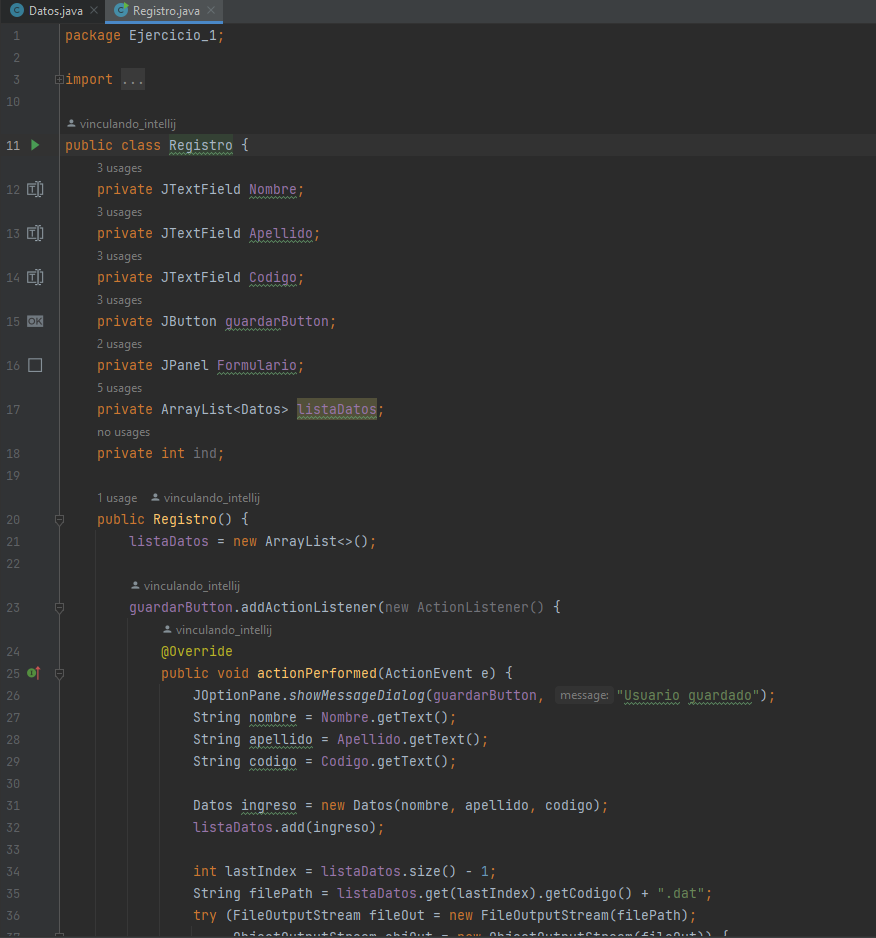
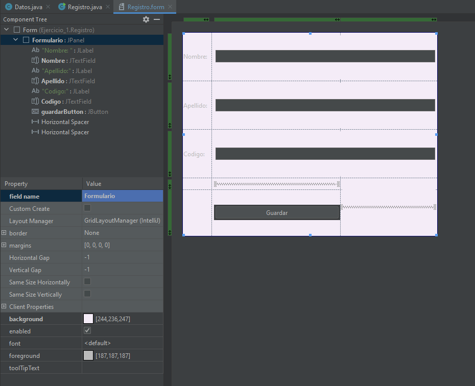
## Ejecucion ejercicio 1
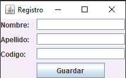
## dat
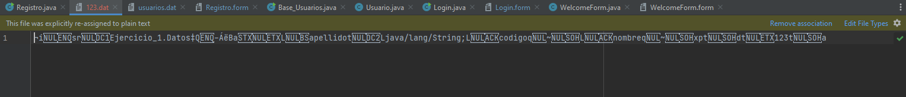

# Ejercicio 2:
## Baseusuario
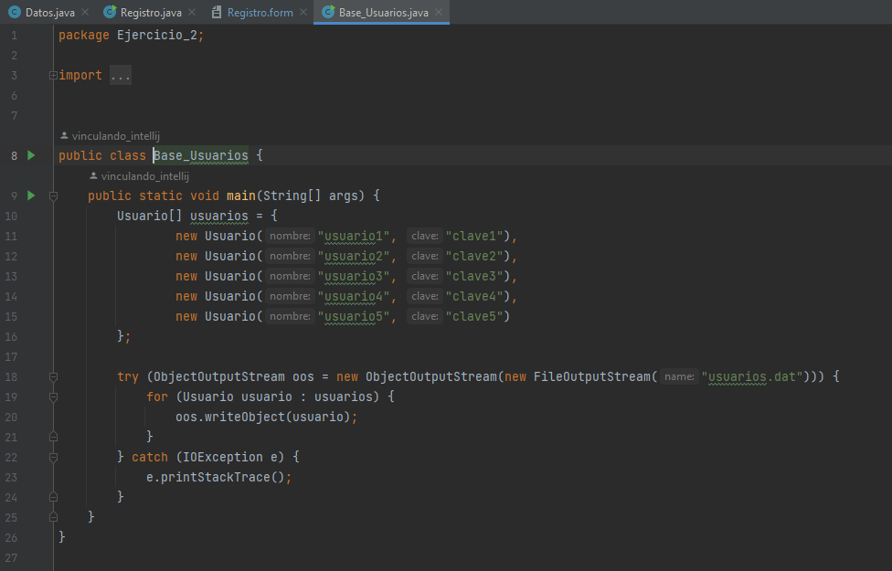
## Usuario 
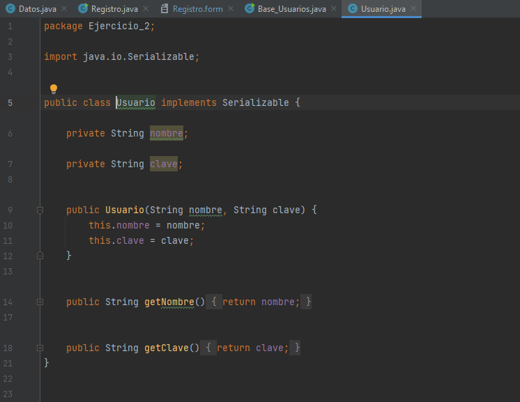
## Login 

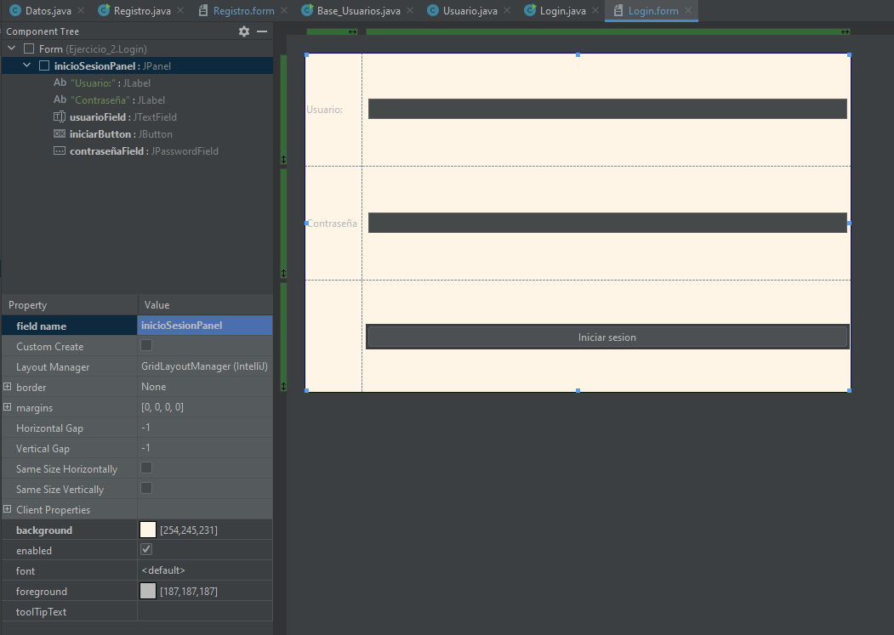
## Bienvenida
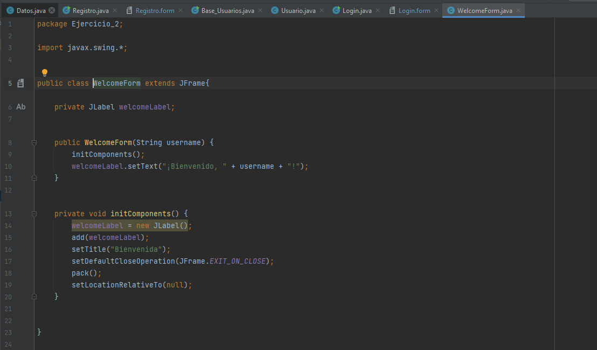

## Ejecucion ejercicio 2
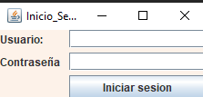
## usuario.dat
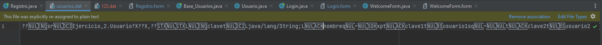

